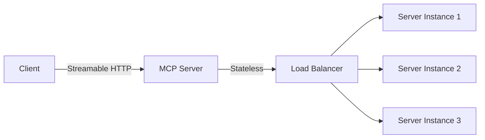

# 🤖 AI Agent 框架全景指南 2026

<div align="center">

**[English](README_EN.md)** | **中文**


*2026年AI Agent框架全面解析：从入门到实战*

</div>

---

## 📖 目录

- [项目简介](#项目简介)
- [为什么需要这个项目](#为什么需要这个项目)
- [2026年Top 10 AI Agent框架](#2026年top-10-ai-agent框架)
- [MCP协议深度解析](#mcp协议深度解析)
- [框架对比与选型指南](#框架对比与选型指南)
- [快速开始](#快速开始)
- [最佳实践](#最佳实践)
- [贡献指南](#贡献指南)
- [许可证](#许可证)

---

## 🎯 项目简介

随着AI Agent技术的快速发展，2026年涌现出了众多优秀的框架和工具。本项目旨在：

1. **全面梳理**：整理2026年最主流的AI Agent框架
2. **深度解析**：深入分析MCP（Model Context Protocol）协议
3. **实战指南**：提供框架选型和最佳实践建议
4. **持续更新**：跟踪最新技术发展动态

---

## 🤔 为什么需要这个项目

### 痛点

- **信息过载**：框架太多，不知道选哪个
- **缺乏对比**：没有系统的框架对比资料
- **实战缺失**：理论多，实战少
- **更新滞后**：技术发展快，资料容易过时

### 解决方案

本项目提供：
- ✅ 系统化的框架对比
- ✅ 实战代码示例
- ✅ 最佳实践指南
- ✅ 持续更新机制

---

## 🏆 2026年Top 10 AI Agent框架

### 框架排名（按GitHub Stars）

| 排名 | 框架 | Stars | 语言 | 特点 |
|------|------|-------|------|------|
| 1 | **LangChain** | ⭐ 122,850 | Python | 最流行的LLM应用框架 |
| 2 | **MetaGPT** | ⭐ 61,919 | Python | 多Agent框架，模拟软件公司 |
| 3 | **AutoGen** | ⭐ 52,927 | Python | 微软的多Agent对话系统 |
| 4 | **LlamaIndex** | ⭐ 46,100 | Python | LLM数据连接框架 |
| 5 | **CrewAI** | ⭐ 41,871 | Python | 角色扮演Agent协作框架 |
| 6 | **Agno** | ⭐ 36,414 | Python | 多Agent部署管理框架 |
| 7 | **Haystack** | ⭐ 23,741 | Python | 生产级AI编排框架 |
| 8 | **Vercel AI SDK** | ⭐ 20,400 | TypeScript | TypeScript AI工具包 |
| 9 | **Open-AutoGLM** | ⭐ 19,800 | Python | 手机Agent自动化框架 |
| 10 | **Mastra** | ⭐ 19,021 | TypeScript | TypeScript原生Agent框架 |

### 特别推荐

- **OpenAI Agents SDK** ⭐ 18,022 - OpenAI官方多Agent框架
- **Google ADK Python** ⭐ 16,800 - Google Agent开发工具包
- **Pydantic AI** ⭐ 14,000 - Pythonic方式构建AI Agent

### 关键趋势

1. **Python主导**：8/10框架使用Python
2. **TypeScript崛起**：Vercel AI SDK和Mastra为JS/TS开发者提供选择
3. **多Agent协作**：MetaGPT、AutoGen、CrewAI专注多Agent场景
4. **生产级框架**：Haystack、Agno面向企业级部署

---

## 🔌 MCP协议深度解析

### 什么是MCP？

**MCP（Model Context Protocol）** 是Anthropic于2024年11月发布的开放标准，用于标准化AI应用与外部工具、数据库和API的连接方式。

> 💡 **类比**：MCP就像AI应用的USB-C接口——一个通用的连接标准。

### MCP 2026路线图

#### 四大优先领域

##### 1. 传输演进与可扩展性

- **Streamable HTTP**：让MCP服务器作为远程服务运行
- **水平扩展**：解决有状态会话与负载均衡器的冲突
- **服务发现**：标准元数据格式（.well-known）



##### 2. Agent通信

- **Tasks原语**：实验功能已发布
- **生命周期管理**：重试语义、过期策略
- **生产反馈**：基于实际部署迭代

##### 3. 治理成熟

- **贡献者阶梯**：清晰的晋升路径
- **委托模型**：工作组自主接受SEP
- **核心维护者**：保持战略监督

##### 4. 企业就绪

- **审计跟踪**：完整的操作日志
- **SSO集成**：企业级认证
- **网关行为**：统一的入口管理
- **配置可移植性**：跨环境部署

### MCP vs Function Calling

| 特性 | MCP | Function Calling |
|------|-----|------------------|
| 标准化 | ✅ 开放标准 | ❌ 厂商特定 |
| 可组合性 | ✅ 高 | ⚠️ 中 |
| 生态系统 | ✅ 丰富 | ⚠️ 有限 |
| 学习曲线 | ⚠️ 中 | ✅ 低 |
| 灵活性 | ✅ 高 | ⚠️ 中 |

---

## 📊 框架对比与选型指南

### 按场景选型

#### 1. 快速原型开发
- **推荐**：LangChain、LlamaIndex
- **原因**：丰富的组件、完善的文档

#### 2. 多Agent协作
- **推荐**：MetaGPT、AutoGen、CrewAI
- **原因**：内置角色管理、任务分配

#### 3. 生产级部署
- **推荐**：Haystack、Agno
- **原因**：可观测性、扩展性

#### 4. TypeScript生态
- **推荐**：Vercel AI SDK、Mastra
- **原因**：类型安全、现代架构

#### 5. 移动端Agent
- **推荐**：Open-AutoGLM
- **原因**：专注移动设备自动化

### 性能对比

| 框架 | 启动时间 | Token效率 | 扩展性 | 文档质量 |
|------|----------|-----------|--------|----------|
| LangChain | ⚠️ 中 | ✅ 高 | ✅ 高 | ✅ 优秀 |
| MetaGPT | ⚠️ 中 | ⚠️ 中 | ✅ 高 | ✅ 良好 |
| AutoGen | ✅ 快 | ✅ 高 | ✅ 高 | ✅ 良好 |
| LlamaIndex | ✅ 快 | ✅ 高 | ⚠️ 中 | ✅ 优秀 |
| CrewAI | ⚠️ 中 | ⚠️ 中 | ✅ 高 | ✅ 良好 |

---

## 🚀 快速开始

### 环境要求

- Python 3.10+
- Node.js 18+（TypeScript框架）
- Git

### 安装示例

#### LangChain

```bash
pip install langchain langchain-community langchain-openai
```

#### MetaGPT

```bash
pip install metagpt
```

#### AutoGen

```bash
pip install autogen
```

#### Vercel AI SDK

```bash
npm install ai
```

### Hello World示例

#### LangChain

```python
from langchain_openai import ChatOpenAI
from langchain_core.messages import HumanMessage

# 初始化模型
llm = ChatOpenAI(model="gpt-4")

# 发送消息
response = llm.invoke([HumanMessage(content="你好！")])
print(response.content)
```

#### MetaGPT

```python
from metagpt.software_company import SoftwareCompany
from metagpt.roles import ProductManager, Architect, Engineer

# 创建软件公司
company = SoftwareCompany()

# 添加角色
company.hire([ProductManager(), Architect(), Engineer()])

# 启动项目
company.start_project("开发一个TODO应用")
```

---

## 💡 最佳实践

### 1. 框架选择原则

- **需求驱动**：根据具体需求选择框架
- **生态考虑**：优先选择活跃的社区
- **团队技能**：匹配团队技术栈
- **长期维护**：考虑框架的可持续性

### 2. 开发流程

```
需求分析 → 框架选型 → 原型开发 → 测试验证 → 生产部署
    ↓         ↓         ↓         ↓         ↓
  明确目标   对比评估   快速迭代   性能测试   监控运维
```

### 3. 常见陷阱

- ❌ 过度设计：一开始就用最复杂的框架
- ❌ 忽视性能：不关注Token消耗和响应时间
- ❌ 缺乏测试：没有充分的测试覆盖
- ❌ 文档缺失：代码没有文档

### 4. 性能优化

- **缓存机制**：缓存重复查询结果
- **批量处理**：合并多个请求
- **异步执行**：非阻塞操作
- **资源池化**：复用连接和实例

---

## 🤝 贡献指南

### 如何贡献

1. **Fork** 本仓库
2. **创建** 特性分支：`git checkout -b feature/your-feature`
3. **提交** 更改：`git commit -m 'Add your feature'`
4. **推送** 分支：`git push origin feature/your-feature`
5. **创建** Pull Request

### 贡献类型

- 📝 文档改进
- 🐛 Bug修复
- ✨ 新功能
- 📊 数据更新
- 🌐 翻译支持

### 代码规范

- Python：遵循PEP 8
- TypeScript：使用ESLint + Prettier
- 提交信息：使用中文或英文

---

## 📄 许可证

本项目采用 [MIT许可证](LICENSE)。

---

## 🙏 致谢

感谢以下资源的支持：

- [GitHub](https://github.com) - 代码托管
- [MCP官方文档](https://modelcontextprotocol.io) - 协议规范
- [各框架官方仓库](#2026年top-10-ai-agent框架) - 技术参考

---

<div align="center">

**⭐ 如果这个项目对你有帮助，请给个Star支持一下！⭐**

**[English](README_EN.md)** | **中文**

</div>
