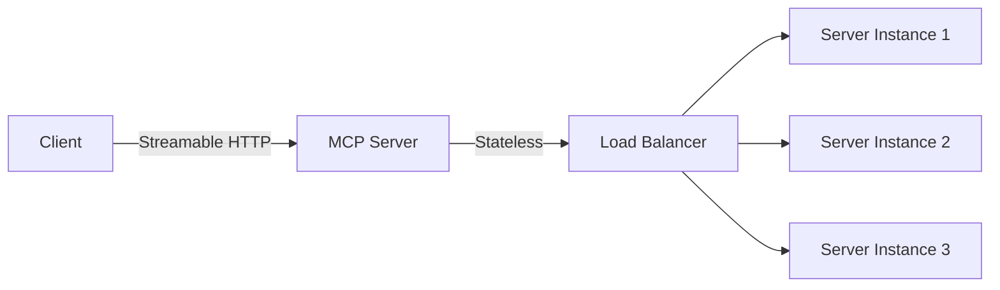

# 🤖 AI Agent Frameworks Guide 2026

<div align="center">

**[中文](README.md)** | **English**


*A comprehensive guide to AI Agent frameworks in 2026*

</div>

---

## 📖 Table of Contents

- [Introduction](#introduction)
- [Why This Project](#why-this-project)
- [Top 10 AI Agent Frameworks 2026](#top-10-ai-agent-frameworks-2026)
- [MCP Protocol Deep Dive](#mcp-protocol-deep-dive)
- [Framework Comparison](#framework-comparison)
- [Quick Start](#quick-start)
- [Best Practices](#best-practices)
- [Contributing](#contributing)
- [License](#license)

---

## 🎯 Introduction

With the rapid development of AI Agent technology, 2026 has seen numerous excellent frameworks and tools. This project aims to:

1. **Comprehensive Overview**: Organize the most mainstream AI Agent frameworks of 2026
2. **Deep Analysis**: In-depth analysis of MCP (Model Context Protocol)
3. **Practical Guide**: Provide framework selection and best practice recommendations
4. **Continuous Updates**: Track the latest technology developments

---

## 🤔 Why This Project

### Pain Points

- **Information Overload**: Too many frameworks, don't know which to choose
- **Lack of Comparison**: No systematic framework comparison materials
- **Missing Practice**: More theory, less practice
- **Outdated**: Technology evolves fast, materials easily become outdated

### Solutions

This project provides:
- ✅ Systematic framework comparison
- ✅ Practical code examples
- ✅ Best practice guide
- ✅ Continuous update mechanism

---

## 🏆 Top 10 AI Agent Frameworks 2026

### Framework Rankings (by GitHub Stars)

| Rank | Framework | Stars | Language | Features |
|------|-----------|-------|----------|----------|
| 1 | **LangChain** | ⭐ 122,850 | Python | Most popular LLM application framework |
| 2 | **MetaGPT** | ⭐ 61,919 | Python | Multi-agent framework, simulates software company |
| 3 | **AutoGen** | ⭐ 52,927 | Python | Microsoft's multi-agent conversation system |
| 4 | **LlamaIndex** | ⭐ 46,100 | Python | LLM data connection framework |
| 5 | **CrewAI** | ⭐ 41,871 | Python | Role-playing agent collaboration framework |
| 6 | **Agno** | ⭐ 36,414 | Python | Multi-agent deployment management framework |
| 7 | **Haystack** | ⭐ 23,741 | Python | Production-ready AI orchestration framework |
| 8 | **Vercel AI SDK** | ⭐ 20,400 | TypeScript | TypeScript AI toolkit |
| 9 | **Open-AutoGLM** | ⭐ 19,800 | Python | Mobile device automation framework |
| 10 | **Mastra** | ⭐ 19,021 | TypeScript | TypeScript-native agent framework |

### Special Mentions

- **OpenAI Agents SDK** ⭐ 18,022 - Official OpenAI multi-agent framework
- **Google ADK Python** ⭐ 16,800 - Google Agent Development Kit
- **Pydantic AI** ⭐ 14,000 - The Pythonic way to build AI agents

### Key Trends

1. **Python Dominance**: 8/10 frameworks use Python
2. **TypeScript Rise**: Vercel AI SDK and Mastra provide options for JS/TS developers
3. **Multi-Agent Collaboration**: MetaGPT, AutoGen, CrewAI focus on multi-agent scenarios
4. **Production-Grade**: Haystack, Agno target enterprise deployment

---

## 🔌 MCP Protocol Deep Dive

### What is MCP?

**MCP (Model Context Protocol)** is an open standard released by Anthropic in November 2024, designed to standardize how AI applications connect to external tools, databases, and APIs.

> 💡 **Analogy**: MCP is like USB-C for AI applications — a universal connection standard.

### MCP 2026 Roadmap

#### Four Priority Areas

##### 1. Transport Evolution and Scalability

- **Streamable HTTP**: Enables MCP servers to run as remote services
- **Horizontal Scaling**: Resolves conflicts between stateful sessions and load balancers
- **Service Discovery**: Standard metadata format (.well-known)



##### 2. Agent Communication

- **Tasks Primitive**: Experimental feature shipped
- **Lifecycle Management**: Retry semantics, expiry policies
- **Production Feedback**: Iterate based on real deployments

##### 3. Governance Maturation

- **Contributor Ladder**: Clear promotion path
- **Delegation Model**: Working groups accept SEPs autonomously
- **Core Maintainers**: Maintain strategic oversight

##### 4. Enterprise Readiness

- **Audit Trails**: Complete operation logs
- **SSO Integration**: Enterprise-grade authentication
- **Gateway Behavior**: Unified entry management
- **Configuration Portability**: Cross-environment deployment

### MCP vs Function Calling

| Feature | MCP | Function Calling |
|---------|-----|------------------|
| Standardization | ✅ Open Standard | ❌ Vendor-specific |
| Composability | ✅ High | ⚠️ Medium |
| Ecosystem | ✅ Rich | ⚠️ Limited |
| Learning Curve | ⚠️ Medium | ✅ Low |
| Flexibility | ✅ High | ⚠️ Medium |

---

## 📊 Framework Comparison

### Selection by Scenario

#### 1. Rapid Prototyping
- **Recommended**: LangChain, LlamaIndex
- **Reason**: Rich components, complete documentation

#### 2. Multi-Agent Collaboration
- **Recommended**: MetaGPT, AutoGen, CrewAI
- **Reason**: Built-in role management, task distribution

#### 3. Production Deployment
- **Recommended**: Haystack, Agno
- **Reason**: Observability, scalability

#### 4. TypeScript Ecosystem
- **Recommended**: Vercel AI SDK, Mastra
- **Reason**: Type safety, modern architecture

#### 5. Mobile Agents
- **Recommended**: Open-AutoGLM
- **Reason**: Focus on mobile device automation

### Performance Comparison

| Framework | Startup Time | Token Efficiency | Scalability | Documentation |
|-----------|--------------|------------------|-------------|---------------|
| LangChain | ⚠️ Medium | ✅ High | ✅ High | ✅ Excellent |
| MetaGPT | ⚠️ Medium | ⚠️ Medium | ✅ High | ✅ Good |
| AutoGen | ✅ Fast | ✅ High | ✅ High | ✅ Good |
| LlamaIndex | ✅ Fast | ✅ High | ⚠️ Medium | ✅ Excellent |
| CrewAI | ⚠️ Medium | ⚠️ Medium | ✅ High | ✅ Good |

---

## 🚀 Quick Start

### Requirements

- Python 3.10+
- Node.js 18+ (for TypeScript frameworks)
- Git

### Installation Examples

#### LangChain

```bash
pip install langchain langchain-community langchain-openai
```

#### MetaGPT

```bash
pip install metagpt
```

#### AutoGen

```bash
pip install autogen
```

#### Vercel AI SDK

```bash
npm install ai
```

### Hello World Examples

#### LangChain

```python
from langchain_openai import ChatOpenAI
from langchain_core.messages import HumanMessage

# Initialize model
llm = ChatOpenAI(model="gpt-4")

# Send message
response = llm.invoke([HumanMessage(content="Hello!")])
print(response.content)
```

#### MetaGPT

```python
from metagpt.software_company import SoftwareCompany
from metagpt.roles import ProductManager, Architect, Engineer

# Create software company
company = SoftwareCompany()

# Add roles
company.hire([ProductManager(), Architect(), Engineer()])

# Start project
company.start_project("Develop a TODO application")
```

---

## 💡 Best Practices

### 1. Framework Selection Principles

- **Requirement-Driven**: Choose framework based on specific needs
- **Ecosystem Consideration**: Prioritize active communities
- **Team Skills**: Match team technology stack
- **Long-term Maintenance**: Consider framework sustainability

### 2. Development Process

```
Requirement Analysis → Framework Selection → Prototype Development → Testing → Production Deployment
        ↓                    ↓                    ↓                  ↓            ↓
   Define objectives    Compare & evaluate    Rapid iteration    Performance    Monitoring
```

### 3. Common Pitfalls

- ❌ Over-design: Starting with the most complex framework
- ❌ Ignoring performance: Not monitoring token consumption and response time
- ❌ Lack of testing: Insufficient test coverage
- ❌ Missing documentation: Code without documentation

### 4. Performance Optimization

- **Caching**: Cache repeated query results
- **Batching**: Combine multiple requests
- **Async Execution**: Non-blocking operations
- **Resource Pooling**: Reuse connections and instances

---

## 🤝 Contributing

### How to Contribute

1. **Fork** this repository
2. **Create** feature branch: `git checkout -b feature/your-feature`
3. **Commit** changes: `git commit -m 'Add your feature'`
4. **Push** branch: `git push origin feature/your-feature`
5. **Create** Pull Request

### Contribution Types

- 📝 Documentation improvements
- 🐛 Bug fixes
- ✨ New features
- 📊 Data updates
- 🌐 Translation support

### Code Standards

- Python: Follow PEP 8
- TypeScript: Use ESLint + Prettier
- Commit messages: Use English or Chinese

---

## 📄 License

This project is licensed under the [MIT License](LICENSE).

---

## 🙏 Acknowledgments

Thanks to the following resources:

- [GitHub](https://github.com) - Code hosting
- [MCP Official Documentation](https://modelcontextprotocol.io) - Protocol specification
- [Framework Official Repositories](#top-10-ai-agent-frameworks-2026) - Technical reference

---

<div align="center">

**⭐ If this project helps you, please give it a Star! ⭐**

**[中文](README.md)** | **English**

</div>
